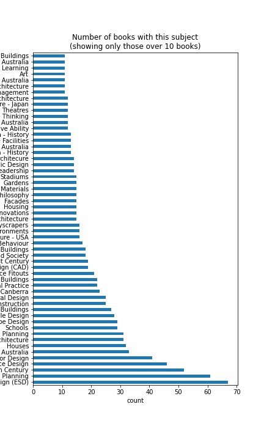

# BVN Library analysis

Prompted by a discussion of how diverse the BVN library is, this is a quick attempt to answer that question.

The `analysis.py` file does a somewhat odd job of loading, cleaning and taking a brief look at the data. There's still a _lot_ left to do.



A graph showing how many books there are for each subject. Note: each book can have many subjects.

## How to get started with this repo

Once you've cloned this repo, from inside the repo folder, run these commands:   (You should be able to just paste it in as a block.)

```
python -m venv --copies lib-env
lib-env\\Scripts\\activate.bat
echo 🚪
python -m pip install --upgrade pip
python -m pip install pip-tools
pip-compile requirements.in
echo 🚀
pip install -r requirements.txt
git init,
echo 🍟🍟🍟
```

Then jump into analysis.py and go sick. 

## TODO

* There's a new file that has some _catalogued on_ dates, merge that in. The data is in `to come soon`.
* The data ingestion file should be separate to the analysis file
* How many books does Sydney/Brisbane have? Is there a bias in subject?
* Work on cleaning and splitting up the other columns. E.g. in this entry:
    ```
    Title    A green vitruvius: principles and practice of ...
    Author                                                 NaN
    Imprint                        London: James & James, 1999
    Subject           Environmentally Sustainable Design (ESD)
    Shelf Location                                  720.47 GRE
    Studio                                            Brisbane
    ```
    The Imprint entry is `London: James & James, 1999` and could be split into 3 columns. (With publication year being the only really important one.)
* Start adding columns that address other discriminating factors to the author table.
